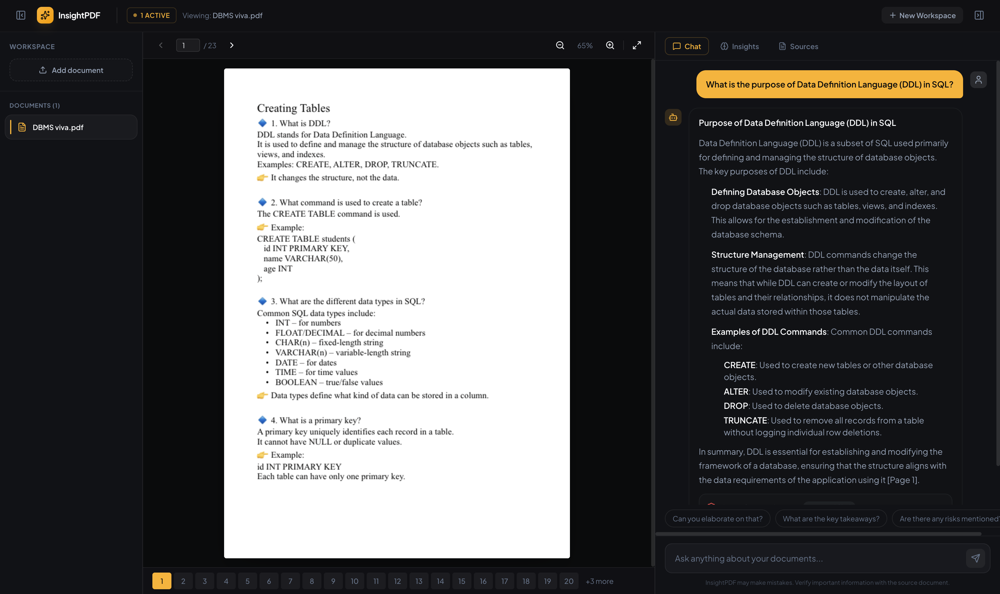

# InsightPDF

InsightPDF is an open-source, full-stack Retrieval-Augmented Generation (RAG) platform designed for document analysis, vector-based semantic search, and grounded Q&A over PDF, DOCX, and TXT files. It combines a FastAPI backend implementing hybrid search (BM25 + FAISS) with Cross-Encoder reranking, post-generation factual grounding verification, and a multi-provider LLM gateway (Google Gemini, Groq, OpenRouter, GitHub Models), paired with a Next.js 16 TypeScript web interface.

## Live Demo

A live interactive demo of InsightPDF is hosted on Hugging Face Spaces:
- **Application URL**: [https://huggingface.co/spaces/Spidey173/insightpdf](https://huggingface.co/spaces/Spidey173/insightpdf)


## Key Features

- **Multi-Format Document Ingestion**: Parses PDF, DOCX, and TXT files using `PyPDF` and `python-docx`, with automated fallback to `PyMuPDF` and `EasyOCR` for scanned document pages.
- **Hybrid Vector & Keyword Search**: Combines dense vector similarity search via FAISS (`all-MiniLM-L6-v2`) with sparse keyword matching using a custom BM25 retriever, fused via Reciprocal Rank Fusion (RRF).
- **Two-Stage Reranking Pipeline**: Refines top-k retrieval results using a Cross-Encoder model (`cross-encoder/ms-marco-MiniLM-L-6-v2`) to filter out low-relevance passages before LLM context construction.
- **Unified Multi-LLM Gateway**: Implements a factory adapter pattern supporting Google Gemini, Groq, OpenRouter, and GitHub Models through environment variable configuration.
- **Factual Grounding & Citation Engine**: Evaluates generated responses against source text using sequence and n-gram overlap algorithms to compute a confidence score and attach page-level citations (`[Page X]`).
- **Real-Time Streaming Responses**: Supports Server-Sent Events (SSE) via FastAPI to stream LLM responses incrementally to the frontend.
- **Automated Document Intelligence**: Extracts executive summaries, key bullet points, and entity metadata (dates, emails, monetary values, organizations) upon file ingestion.
- **Type-Safe Web Dashboard**: Built with Next.js 16, React 19, TypeScript, Tailwind CSS, and Zustand for responsive state management and interactive PDF viewing.

## Architecture Overview

```
[ Frontend: Next.js 16 / React 19 / TypeScript / Zustand ]
                         │               ▲
          HTTP Request   │               │ SSE / JSON
     (Upload / Query)    ▼               │ Response
┌─────────────────────────────────────────────────────────┐
│                    FastAPI Backend                      │
│                                                         │
│ ┌─────────────────────────────────────────────────────┐ │
│ │ Text Extraction & Parsing                           │ │
│ │ (PyPDF / python-docx / PyMuPDF / EasyOCR)           │ │
│ └──────────────────────────┬──────────────────────────┘ │
│                            ▼                            │
│ ┌─────────────────────────────────────────────────────┐ │
│ │ Recursive Chunking (500 char size, 50 overlap)      │ │
│ └──────────────────────────┬──────────────────────────┘ │
│                            ▼                            │
│ ┌──────────────────────────┴────────────────────────┐   │
│ │  Dense Retriever (FAISS) │  Sparse Retriever (BM25)│   │
│ └────────────┬─────────────┴───────────┬────────────┘   │
│              └────────────┬────────────┘                │
│                           ▼                             │
│ ┌─────────────────────────────────────────────────────┐ │
│ │  Reciprocal Rank Fusion (RRF k=60)                  │ │
│ └─────────────────────────┬───────────────────────────┘ │
│                           ▼                             │
│ ┌─────────────────────────────────────────────────────┐ │
│ │  Cross-Encoder Reranker (ms-marco-MiniLM-L-6-v2)    │ │
│ └─────────────────────────┬───────────────────────────┘ │
│                           ▼                             │
│ ┌─────────────────────────────────────────────────────┐ │
│ │  Multi-LLM Adapter Gateway                          │ │
│ │  (Google Gemini / Groq / OpenRouter / GitHub)       │ │
│ └─────────────────────────┬───────────────────────────┘ │
│                           ▼                             │
│ ┌─────────────────────────────────────────────────────┐ │
│ │  Grounding Verification & Page Citation Extractor   │ │
│ └─────────────────────────────────────────────────────┘ │
└─────────────────────────────────────────────────────────┘
```

## Tech Stack

- **Backend**: Python 3.10+, FastAPI 0.115, Uvicorn 0.34, Pydantic, python-dotenv
- **Document Processing**: PyPDF 5.1, python-docx 1.1, PyMuPDF 1.25, EasyOCR 1.7, LangChain Text Splitters
- **Embeddings & Vector Search**: Sentence-Transformers 3.3 (`all-MiniLM-L6-v2`), FAISS (`faiss-cpu` 1.9), Custom BM25 implementation
- **Reranking**: Sentence-Transformers Cross-Encoder (`cross-encoder/ms-marco-MiniLM-L-6-v2`)
- **LLM Gateway**: Google Generative AI SDK, Groq SDK, OpenAI SDK, HTTPX
- **Frontend**: Next.js 16 (App Router), React 19, TypeScript 5, Tailwind CSS v4
- **State Management & UI**: Zustand 5, Framer Motion 12, Lucide React, react-dropzone, react-pdf / pdfjs-dist
- **Containerization**: Multi-stage Dockerfile (Node 20 build stage, Python 3.10 runtime stage)

## Project Structure

```
InsightPDF/
├── Dockerfile                   # Multi-stage Docker build file
├── DEPLOYMENT.md                # Deployment notes and guide
├── README.md                    # Project documentation
├── backend/                     # FastAPI backend application
│   ├── .env.example             # Environment variable template
│   ├── config.py                # Centralized app configuration & singleton model registry
│   ├── conversation.py          # Session history and memory management
│   ├── insights_engine.py       # Entity extraction & summary generation module
│   ├── llm_service.py           # Unified multi-LLM provider gateway
│   ├── main.py                  # FastAPI entrypoint and API routes
│   ├── models.py                # Pydantic request/response schemas
│   ├── pdf_processor.py         # Multi-format document parser & text chunker
│   ├── requirements.txt         # Python backend dependencies
│   ├── reranker.py              # Cross-Encoder passage reranking module
│   ├── vector_store.py          # FAISS + BM25 hybrid vector store implementation
│   └── verification.py          # Grounding score evaluation & citation extractor
└── frontend-next/               # Next.js 16 web application
    ├── app/                     # Next.js App Router pages and layouts
    ├── components/              # UI components (Upload, Q&A, PDF Viewer, Insights)
    ├── lib/                     # API client utilities and state stores
    ├── package.json             # Node.js dependencies and scripts
    └── tsconfig.json            # TypeScript configuration
```

## Installation

### Prerequisites

- Python 3.10 or higher
- Node.js 20 or higher
- npm 10 or higher

### 1. Clone the Repository

```bash
git clone https://github.com/your-username/InsightPDF.git
cd InsightPDF
```

### 2. Backend Setup

```bash
cd backend
python3 -m venv venv
source venv/bin/activate
pip install -r requirements.txt
```

### 3. Frontend Setup

```bash
cd ../frontend-next
npm install
```

## Configuration (.env example)

Create a `.env` file inside the `backend/` directory based on `backend/.env.example`:

```env
# Primary LLM API Key (Select corresponding provider below)
GOOGLE_API_KEY=your_google_api_key_here
GROQ_API_KEY=your_groq_api_key_here
OPENROUTER_API_KEY=your_openrouter_api_key_here
GITHUB_TOKEN=your_github_token_here

# LLM Provider Selection: 'google', 'groq', 'openrouter', or 'github'
LLM_PROVIDER=google

# LLM Generation Parameters
LLM_TEMPERATURE=0.1
LLM_MAX_TOKENS=1500

# Embedding & Search Configuration
EMBEDDING_MODEL=all-MiniLM-L6-v2
EMBEDDING_BATCH_SIZE=64
RERANKER_MODEL=cross-encoder/ms-marco-MiniLM-L-6-v2
RERANKER_ENABLED=true

# Chunking Parameters
CHUNK_SIZE=500
CHUNK_OVERLAP=50

# Optical Character Recognition (OCR) Fallback
OCR_ENABLED=true

# Application Storage & Security
UPLOAD_DIR=./uploads
MAX_FILE_SIZE_MB=50
CORS_ORIGINS=http://localhost:3000,http://127.0.0.1:3000
```

For frontend configuration, optionally set `NEXT_PUBLIC_API_URL` in `frontend-next/.env.local` (defaults to `http://localhost:8000` if omitted).

## Running Locally

### Start Backend Service

```bash
cd backend
source venv/bin/activate
uvicorn main:app --reload --host 0.0.0.0 --port 8000
```

The FastAPI backend runs at `http://localhost:8000`. API documentation is available at `http://localhost:8000/docs`.

### Start Frontend Application

```bash
cd frontend-next
npm run dev
```

The frontend dashboard runs at `http://localhost:3000`.

## Docker Setup

The project includes a multi-stage `Dockerfile` that builds the Next.js static asset bundle and serves both frontend and FastAPI backend in a single container.

### Build Container Image

```bash
docker build -t insightpdf .
```

### Run Container

```bash
docker run -p 7860:7860 \
  -e GOOGLE_API_KEY=your_google_api_key_here \
  -e LLM_PROVIDER=google \
  insightpdf
```

Access the unified application at `http://localhost:7860`.

## API Endpoints

### Core Service Endpoints

| Method | Endpoint | Description |
| :--- | :--- | :--- |
| `POST` | `/api/upload` | Upload document file (`multipart/form-data`) to initialize session and process vector embeddings. |
| `POST` | `/api/query` | Submit natural language query over uploaded document context; returns JSON response with grounding metrics. |
| `POST` | `/api/query/stream` | Stream LLM response chunks using Server-Sent Events (SSE). |
| `GET` | `/api/documents/{session_id}/pdf` | Retrieve uploaded PDF file for in-browser rendering. |
| `GET` | `/api/documents/{session_id}/insights` | Retrieve extracted document metadata, summary, key points, and entities. |
| `GET` | `/api/sessions/{session_id}/history` | Fetch conversation message history for a session. |
| `GET` | `/api/sessions/{session_id}` | Check active session configuration and loaded file list. |
| `GET` | `/api/health` | System health check reporting active session count and loaded ML model statuses. |

## Screenshots


*Figure 1: Main document upload interface and analytics dashboard.*


*Figure 2: Interactive document Q&A interface displaying inline page citations and grounding score.*


*Figure 3: Extracted entity overview, key highlights, and document metadata summary.*

## Example Usage

### 1. Upload a Document

```bash
curl -X POST "http://localhost:8000/api/upload" \
  -F "file=@/path/to/sample_document.pdf"
```

**Response Payload**:

```json
{
  "session_id": "b3e94a80-4c12-4217-910f-f4460d3d2a01",
  "filename": "sample_document.pdf",
  "total_pages": 12,
  "total_chunks": 48,
  "insights": {
    "summary": "Document overview outlining Q3 financial results...",
    "key_points": ["Revenue increased by 14%", "Operating margin expanded to 22%"],
    "entities": {
      "dates": ["September 30, 2025"],
      "monetary_values": ["$4.2 million"],
      "organizations": ["Acme Corp"]
    }
  }
}
```

### 2. Query the Document

```bash
curl -X POST "http://localhost:8000/api/query" \
  -H "Content-Type: application/json" \
  -d '{
    "session_id": "b3e94a80-4c12-4217-910f-f4460d3d2a01",
    "question": "What was the operating margin in Q3?",
    "llm_provider": "google",
    "temperature": 0.1
  }'
```

**Response Payload**:

```json
{
  "answer": "According to the report, the operating margin expanded to 22% in Q3 [Page 4].",
  "citations": [
    {
      "citation_id": 1,
      "page": 4,
      "source_file": "sample_document.pdf",
      "highlighted_text": "Operating margin expanded to 22% during the third quarter..."
    }
  ],
  "grounding_score": 0.95,
  "execution_time_ms": 420.5
}
```

## Design Decisions

### Hybrid Search (BM25 + FAISS) via Reciprocal Rank Fusion

Standard dense vector embeddings excel at semantic similarity but often fail to match exact domain-specific identifiers, technical acronyms, invoice IDs, or numeric figures. Pure sparse search (BM25) handles exact keyword matches but fails on semantic variations. 

InsightPDF combines dense vector search (FAISS IndexFlatIP over normalized embeddings) with a custom BM25 sparse retriever. Results from both retrievers are merged using Reciprocal Rank Fusion (RRF, $k=60$). RRF assigns rank scores without requiring score normalization across disparate distribution spaces, producing a balanced candidate set.

### Two-Stage Retrieval with Cross-Encoder Reranking

Bi-encoder models embedded via vector distance measure global context similarity fast ($O(N)$ dot products), but lose fine-grained token-level cross-attention. 

To prevent context dilution, InsightPDF implements a two-stage pipeline:
1. **Stage 1 (Candidate Retrieval)**: Initial top 20 passages are retrieved via hybrid search.
2. **Stage 2 (Reranking)**: A Cross-Encoder (`ms-marco-MiniLM-L-6-v2`) performs joint full-attention scoring on the `(query, passage)` pairs, ranking passages by true contextual relevance. The top 5 passages are selected for LLM prompt construction.

This approach balances retrieval throughput with high precision context generation.

### Decoupled Multi-LLM Gateway Pattern

To avoid vendor lock-in and handle provider availability fluctuations, `backend/llm_service.py` encapsulates model interactions behind a unified interface (`FreeLLMService`). Adding or switching model providers (Google Gemini, Groq, OpenRouter, GitHub Models) requires updating configuration variables without altering business logic or API endpoint contracts.

### In-Memory Session Management

Session data—including FAISS vector indices, parsed text chunks, and conversation histories—is maintained in a thread-safe Python dictionary in memory. This eliminates external database dependencies during local deployment and evaluation. The trade-off is that session data is non-persistent and restricted to single-node deployments.

## Performance Considerations

- **Singleton Model Initialization**: Heavy machine learning models (`SentenceTransformer` and `CrossEncoder`) are loaded lazily via a singleton `ModelRegistry` class (`config.py`). This prevents redundant memory allocations and eliminates cold-start overhead on individual request handlers.
- **CPU-Optimized Embeddings**: Model choices (`all-MiniLM-L6-v2` and `ms-marco-MiniLM-L-6-v2`) are lightweight, executing vector generation and reranking in sub-100ms timings on standard multi-core CPUs without requiring dedicated GPU infrastructure.
- **Bounded Context Windows**: Truncating retrieved context to the top 5 reranked chunks (500 characters per chunk) reduces input token size sent to LLM APIs, minimizing latency and API usage costs.

## Security Considerations

- **API Key Safeguards**: Provider API keys are managed through server-side environment variables (`.env`) loaded via `python-dotenv` and are never exposed to client-side code bundles.
- **Input Validation**: All incoming API requests are validated against Pydantic models (`models.py`) to enforce strict type checking and reject malformed payloads.
- **File Upload Limits & Extension Sanitization**: Uploads are validated against permitted file extensions (`.pdf`, `.docx`, `.txt`) and enforced by a configurable size limit (`MAX_FILE_SIZE_MB=50`).
- **CORS Restricted Origins**: FastAPI CORS middleware is configured via environment settings (`CORS_ORIGINS`) to prevent unauthorized cross-origin requests in web environments.

## Testing

- **Current Status**: Automated test suites (unit, integration, and end-to-end) are not currently included in this repository.
- **Manual Verification**: System behavior and API endpoints have been validated via FastAPI interactive documentation (`/docs`), manual HTTP client execution, and end-to-end frontend dashboard testing.
- **Target Verification Plan**: Implementation of unit testing for chunking, hybrid retrieval, and verification modules is documented under [Future Improvements](#future-improvements).

## Known Limitations

- **Transient In-Memory Storage**: Active sessions, vector indexes, and conversation history exist solely in backend RAM. Restarting or redeploying the FastAPI application resets all active user sessions.
- **Single-Node Memory Scale**: Scalability is bounded by server memory footprint, as hosting multiple active FAISS indices simultaneously increases RAM consumption.
- **Scanned PDF Processing Latency**: Processing scanned image-only PDFs requires CPU-based OCR (`EasyOCR`), which significantly increases initial upload ingestion time compared to native text extraction.
- **Lack of User Authentication**: The current backend does not enforce authentication or tenant isolation beyond random UUID session keys.

## Future Improvements

- [ ] **Persistent Vector Database**: Migrate from local in-memory FAISS indices to dedicated vector database services (e.g., Qdrant, Chroma, or Pinecone).
- [ ] **Database & Object Storage Integration**: Replace in-memory session dictionaries with PostgreSQL for metadata/history and S3/GCS object storage for document files.
- [ ] **Automated Test Suite**: Implement `pytest` suites for python backend pipeline components and `vitest` / Playwright tests for frontend components.
- [ ] **CI/CD Pipeline**: Add GitHub Actions workflows for automated code linting, type checking, container builds, and testing.
- [ ] **Multi-Tenant Authentication**: Add OAuth2 / JWT authentication and user account management.
- [ ] **Advanced Document Parsing**: Integrate layout-aware document parsers for complex multi-column tables, formulas, and diagrams.

## Contributing

Contributions are welcome. To contribute:

1. Fork the repository.
2. Create a feature branch:
   ```bash
   git checkout -b feature/your-feature-name
   ```
3. Commit your changes following standard commit message conventions:
   ```bash
   git commit -m "feat: add vector store index caching"
   ```
4. Push to your branch:
   ```bash
   git push origin feature/your-feature-name
   ```
5. Open a Pull Request detailing the problem solved and changes implemented.

### Code Style Guidelines

- **Python**: Follow PEP 8 guidelines. Type hints are encouraged for public functions.
- **TypeScript / React**: Follow ESLint configuration included in `frontend-next/`. Ensure proper typing and component decomposition.

## License

This project is released under the [MIT License](LICENSE).
